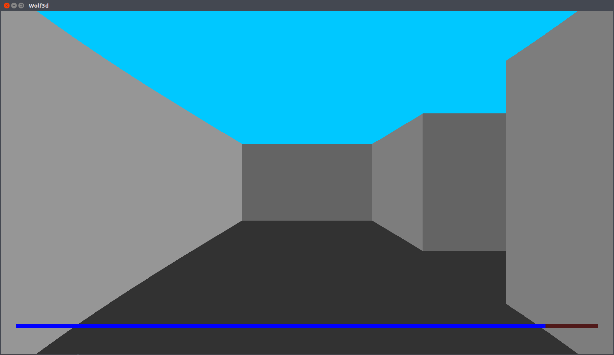
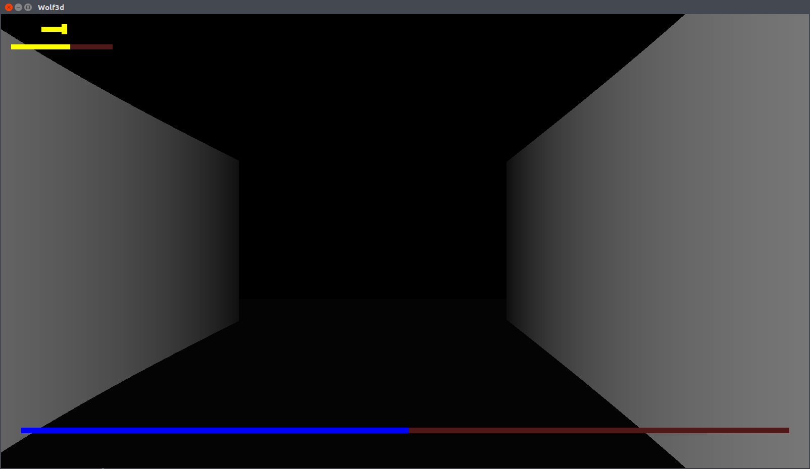
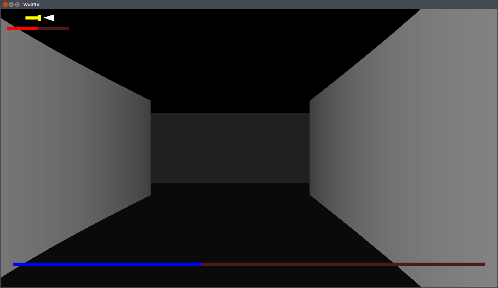
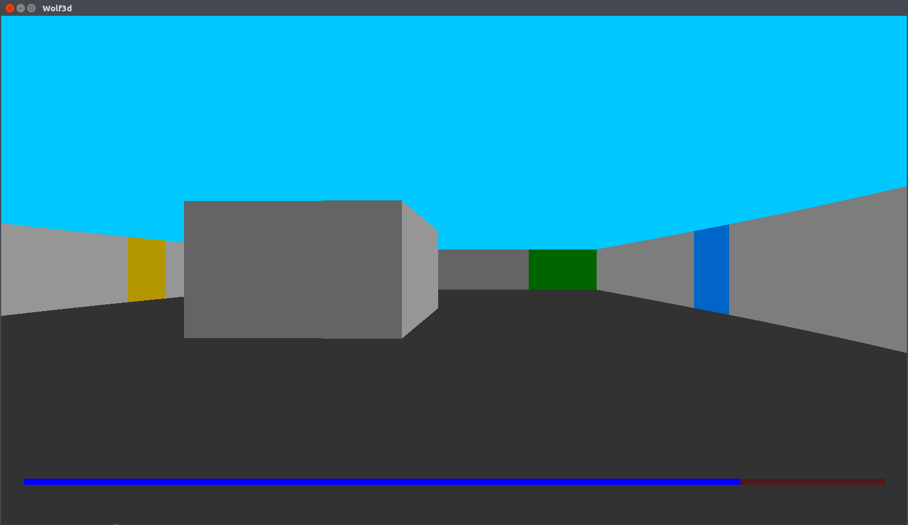

# wolf3d
This project was one of my first graphical projects from my first year at EPITECH (2016-2017).

The goal was to create a first-person view inside of a maze by using [raycasting](https://en.wikipedia.org/wiki/Ray_casting).

<br>

Language: **C**

Group size: **1**

Compilation: **on GNU/Linux via Makefile**

Project duration: **~1 month** (12/12/2016 - 15/01/2017)

#### Required library: **CSFML** graphic library
To install it: 
* on Debian / Ubuntu: `sudo apt-get install libcsfml-dev`
* on Arch Linux: `sudo pacman -S csfml`
* on other distributions, download it [here](https://www.sfml-dev.org/download/csfml/)

<br>

## Usage
```
./wolf3d -h
USAGE
		./wolf3d map.txt
DESCRIPTION
map.txt		File representing the level for the wolf3d game,
		containing '0' for places where you can move and '1' for walls;
		'2' represents the exit, '3' the places where you can refill
		your battery, and '4' the places where you can reset the timer.
HOW TO PLAY
		You can move with the 'ZQSD' keys,
		and turn the camera with the arrows.
NIGHT MODE
		Turn on Nightmode by pressing 'N'. Use flashlight with the 'F' key.
		To quit Nightmode, press 'B'.
NOTES
		An empty map file is considered as nonexistent.
AUTHOR
		Made by Mael Drapier
```
<br>

## Authorized functions for this project:

C Math library (-lm), `open`, `close`, `read`, `write`, `malloc`, `free`, `socket`, `close`, `bind`, `sendto`, `recvfrom`, all libdl’s functions

### CSFML functions:

`sfRenderWindow_isOpen`, `sfRenderWindow_pollEvent`, `sfRenderWindow_waitEvent`, `sfRenderWindow_clear`, `sfRenderWindow_drawSprite`, `sfRenderWindow_display`, `sfRenderWindow_create`, `sfRenderWindow_destroy`, `sfRenderWindow_close`, `sfTexture_create`, `sfTexture_updateFromPixels`, `sfTexture_destroy`, `sfSprite_create`, `sfSprite_setTexture`, `sfSprite_destroy`, all of System module’s functions, all of Window module’s functions, all of Audio module’s functions

<br>

## Screenshots




